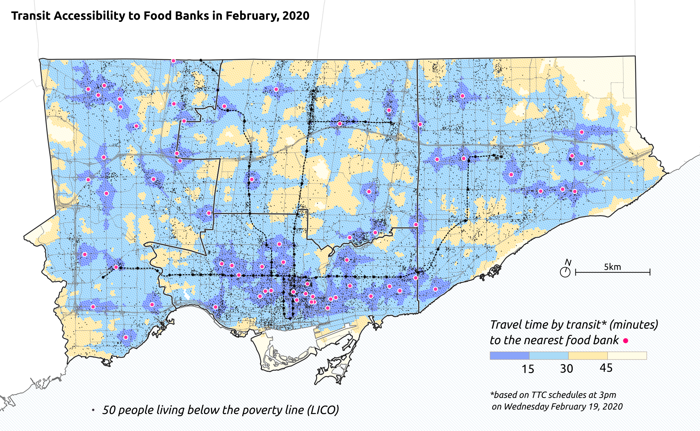
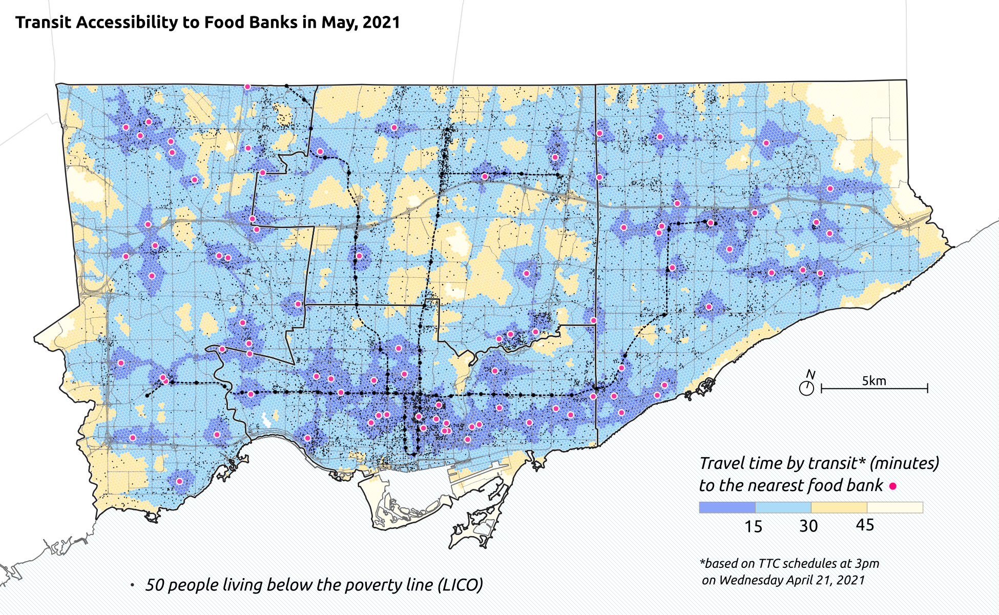
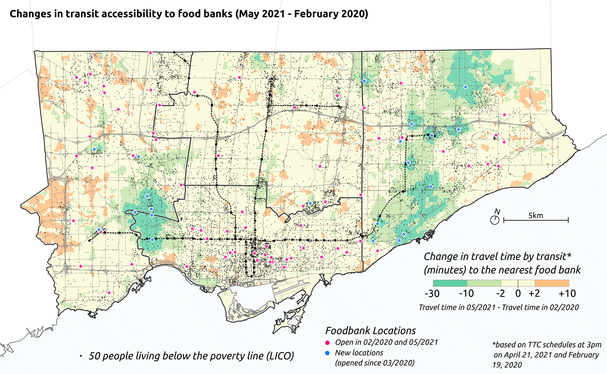

**Transit accessibility to food banks in Toronto prior to and during COVID-19**

Code and results for measuring transit accessibility to food banks in Toronto for Feb 2020 and April 2021. Food bank locations were provided by [Daily Bread](https://www.dailybread.ca/), travel times computed via [R5R](https://github.com/ipeaGIT/r5r) with GTFS data from the [TTC](https://transitfeeds.com/p/ttc/33) and walking network data from [OpenStreetMap](https://www.openstreetmap.org/), and maps and plots created with Python/R/QGIS/Inkscape.

Results:

